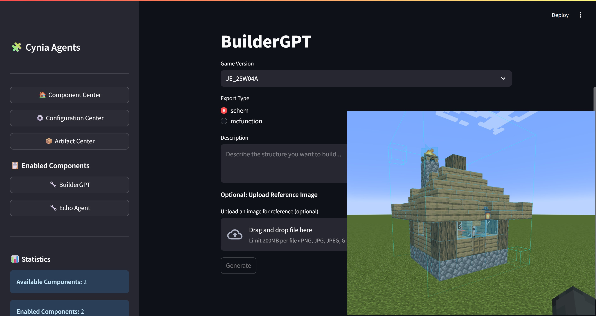

<div align="center">
  
   <h1>BuilderGPT</h1>
   
   
   <br>
</div>

A generative Minecraft structure tool for the [Cynia Agents](https://github.com/CyniaAI/CyniaAgents) framework.

BuilderGPT lets you describe a building and have a language model produce a ready-to-use schematic. The component outputs either a `.schem` file or a `.mcfunction` script that can be imported into the game with tools like WorldEdit.

*\* Structure in the banner is generated by BuilderGPT with model `gemini-2.5-flash-preview-05-20`.*

## Installation

1. Install the Cynia Agents framework by following the instructions in its repository.
2. Copy this `BuilderGPT` folder into the framework's `components/` directory.
3. Install the requirements in the same Python environment:
   ```bash
   pip install -r components/BuilderGPT/requirements.txt
   ```
4. Start the Cynia Agents UI (`python -m streamlit run web.py`).
5. Enable **BuilderGPT** from the *Component Center* page.

## Usage

After enabling, a new **BuilderGPT** page appears in the sidebar. Select your Minecraft version, choose an export format and describe the structure you want. The component will call the configured LLM provider and save the resulting file inside the `generated/` folder.

## Features

- Generate structures using natural language
- Export as `.schem` or `.mcfunction`
- Works entirely within Cynia Agents

## License

This project is licensed under the Apache 2.0 License. See [LICENSE](LICENSE) for details.
